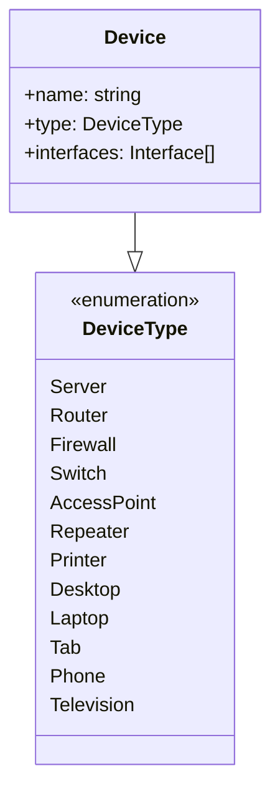

# Device

## Device Class

The `Device` class represents a network device with the following properties:

- `name`: A string representing the name of the device.
- `type`: An enumeration (`DeviceType`) indicating the type of device (e.g., Router, Printer, Desktop).
- `interfaces`: An array of `Interface` objects associated with the device.

## DeviceType Enumeration

The `DeviceType` enumeration defines the possible types of devices in the network:

- `Server`
- `Router`
- `Firewall`
- `Switch`
- `AccessPoint`
- `Repeater`
- `Printer`
- `Desktop`
- `Laptop`
- `Tab`
- `Phone`
- `Television`

Each type helps categorize the device for better network management and organization.

### Relationships

- A `Device` is associated with one `DeviceType`.
- A `Device` can have multiple `Interface` objects.
- The `DeviceType` enumeration is used to specify the type of a `Device`.
- The `Interface` class is defined in a separate module and represents the network interfaces of the device.
