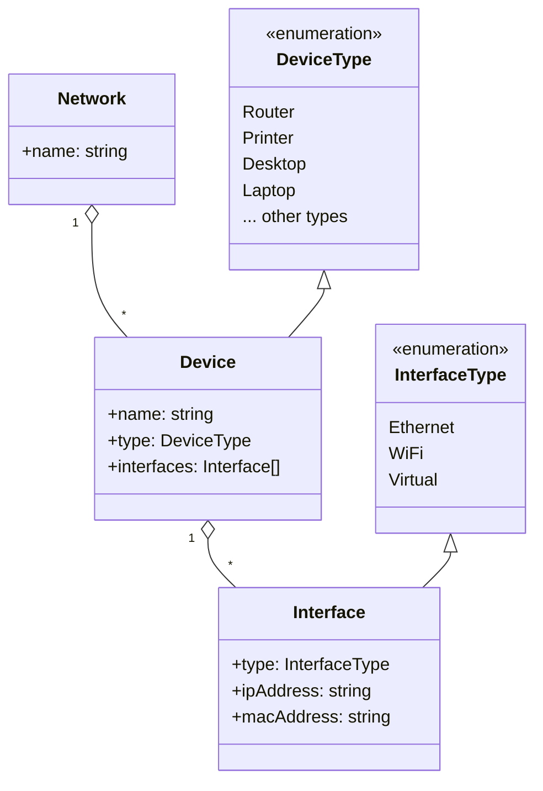

# Class Diagrams

```mermaid
classDiagram
    class Network {
        +name: string
    }
    class Device {
        +name: string
        +type: DeviceType
        +interfaces: Interface[]
    }
    class DeviceType {
        <<enumeration>>
        Router
        Printer
        Desktop
        Laptop
        ... other types
    }
    class Interface {
        +type: InterfaceType
        +ipAddress: string
        +macAddress: string
    }
    class InterfaceType {
        <<enumeration>>
        Ethernet
        WiFi
        Virtual
    }

    Network "1" o-- "*" Device
    Device "1" o-- "*" Interface
    DeviceType <|-- Device
    InterfaceType <|-- Interface
```
