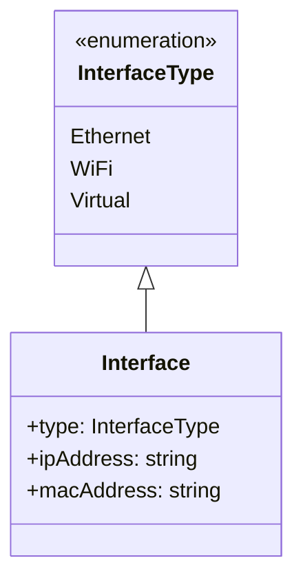

# Interface

## Interface Class

The `Interface` class represents a network interface with the following properties:

- `type`: An enumeration (`InterfaceType`) indicating the type of interface (e.g., Ethernet, WiFi, Virtual).
- `ipAddress`: A string representing the IP address assigned to the interface.
- `macAddress`: A string representing the MAC address of the interface.

## InterfaceType Enumeration

The `InterfaceType` enumeration defines the possible types of network interfaces:

- `Ethernet`
- `WiFi`
- `Virtual`

Each type helps categorize the interface for better network management and organization.

### Relationships

- An `Interface` is associated with one `InterfaceType`.
- A `Device` can have multiple `Interface` objects.
