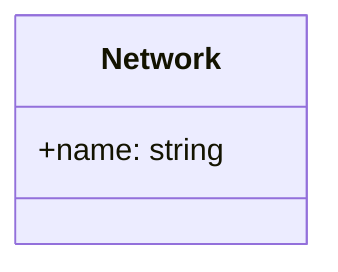

# Network

## Network Class

The `Network` class represents a network with the following property:

- `name`: A string representing the name of the network.

### Relationships

- A `Network` can contain multiple `Device` objects.
- A `Device` is associated with one `Network`.
